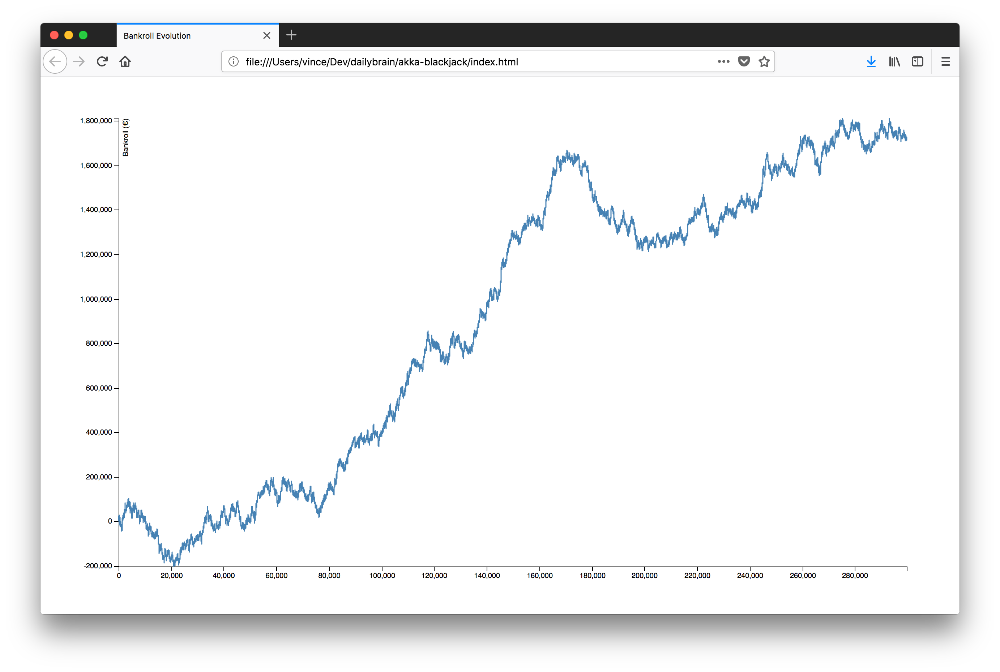
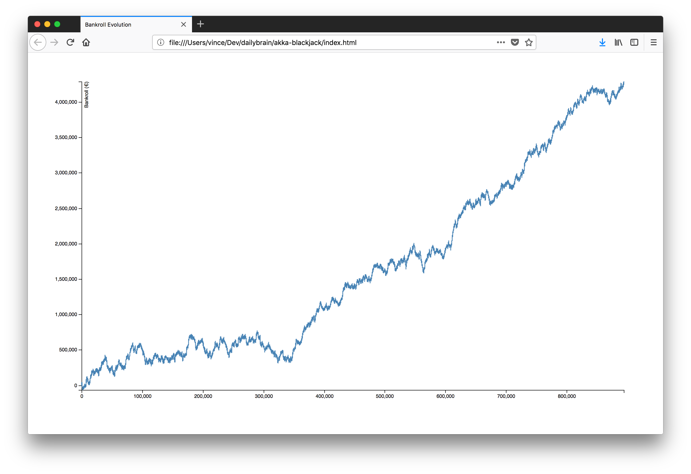
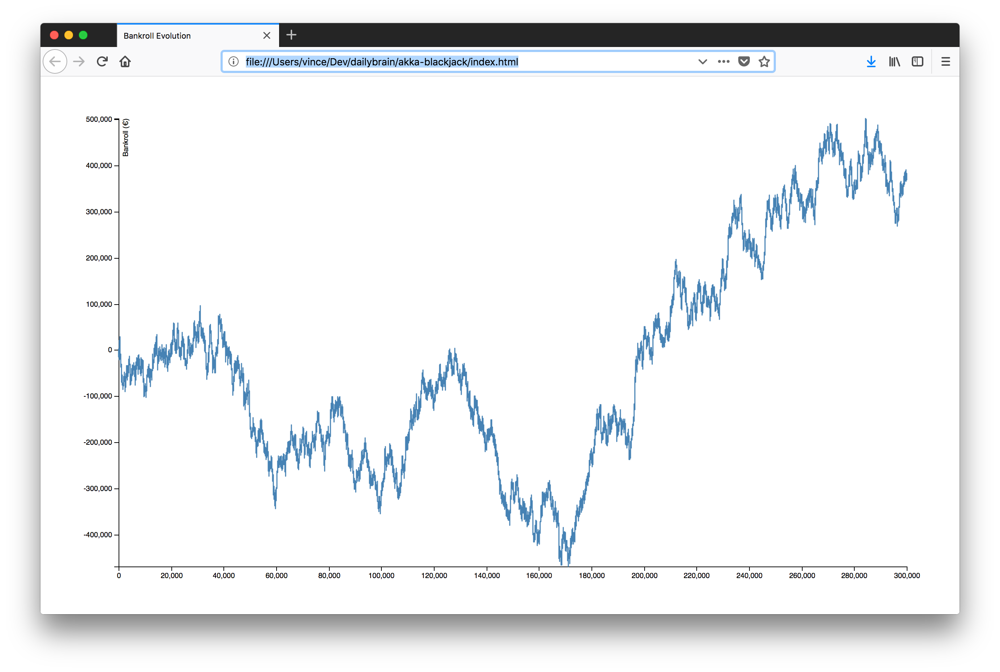

# Akka BlackJack

* Simulate a BlackJack game using [Akka](https://akka.io)
* Display results using [D3.js](https://d3js.org)

## Rules

* 6 Decks
* S17
* DOA
* DAS
* SPL3
* No RSA
* ENHC
* ES

## Demo

    sbt test
    
    sbt run
    open index.html

## Results

This game have 0.11% advantage, so you will win on the long run,     
but a huge [variance](https://en.wikipedia.org/wiki/Variance) is expected !   

You can beat the [variance](https://en.wikipedia.org/wiki/Variance) by increasing rounds in [Main.scala](src/main/scala/fr/dailybrain/akka/blackjack/Main.scala)    

*Note:* You usually play 150 rounds per hour, 2000 hours per year when you are a Pro.

### 1.7 Millions after 1 year 

### 4 Millions after 3 Years

### Huge Swing | -450k to +350k after 1 year

### Huge Loss | -500k to -200k after 1 year

