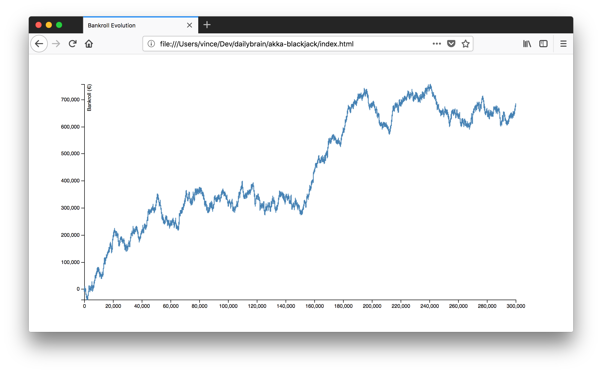
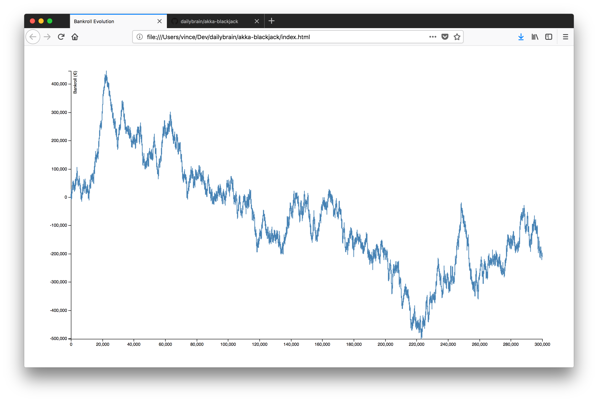
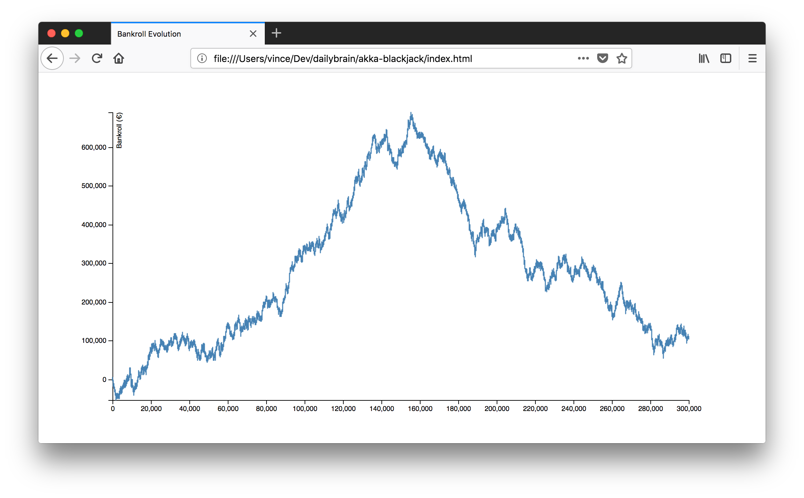

# Akka BlackJack

* Simulate a BlackJack game using [Akka](https://akka.io)
* Show results in [D3.js](https://d3js.org)

## Rules

* 6D
* S17
* DOA
* DAS
* SPL3
* No RSA
* ENHC
* ES

## Demo

    sbt run
    open index.html

## Results

This game have 0.11% advantage, a huge [variance](https://en.wikipedia.org/wiki/Variance) is expected !

